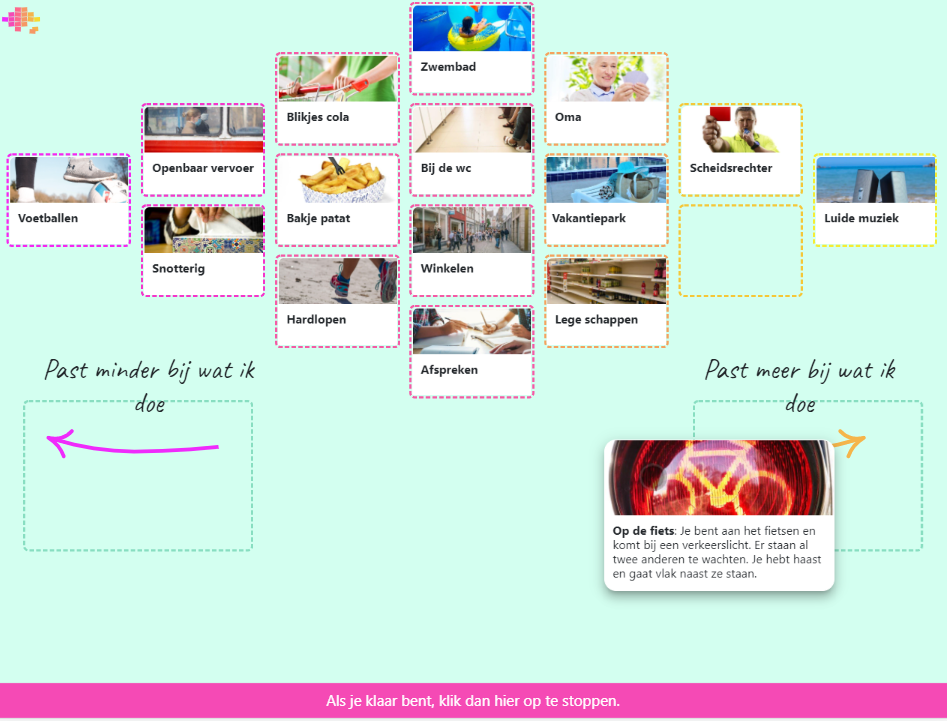

# Qsort 
 
Qsort is an application based on the <a href="https://en.wikipedia.org/wiki/Q_methodology">Q Methodology</a>.



This application is created for secondary/higher education. There is also an React application created for primary education which can be found <a href="https://github.com/Citolab/sortboard">here</a>

<a href="https://www.cito.nl/kennis-en-innovatie/prototypes/projecten/sortboard">Click here</a> for more information (Dutch only).

The live version can be found here: <a href="https://empathischhandelen.citolab.nl/">https://empathischhandelen.citolab.nl/</a>


# Techniques

An Angular application created with <a href="https://nx.dev/">Nx</a>.

### static data

The cards to be sort can be imported using an Excel sheet. ```apps/functions/console.ts``` will handle the excel import.
Images can be added in the assets folder, or can be imported base64 in the database to be more dynamic. See code in excelprocessor.ts.  

Besides from the firebase configuration, categories and text on the left and right side, that can be changed in:  ```apps\qsort\src\environments\environment.ts``` 

